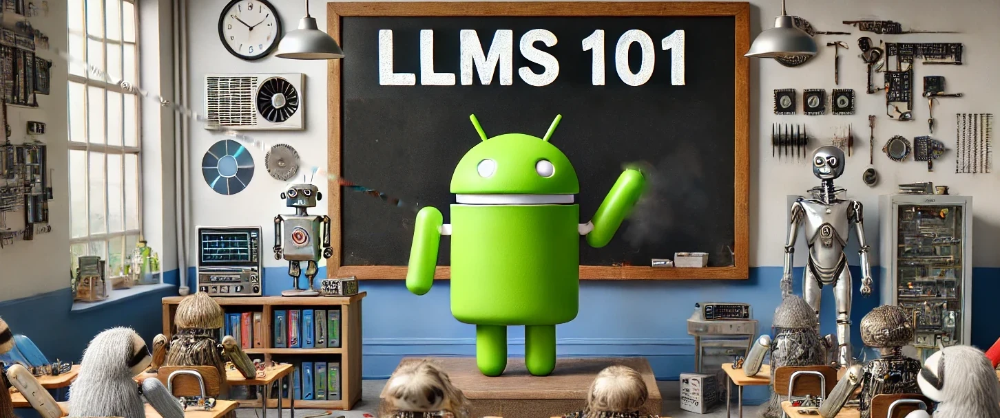

# LLMs ... on LLMs

## "If they can create pizza recipes and write emails, they can explain how they're made, right?"

 Large language models (LLMs) are fast-evolving tools with incredible capabilities that are fast revolutionising how humans interface with technology.

 LLMs excel in research, gathering sources, and summarising complex topics.

This made me wonder (maybe you had the same thought!):

*If that's the case ... can you ask LLMs to explain how THEY work!?*

I've been keeping a record of my prompts and outputs since the summer - the slowly evolving archive is at [DanielGoesPrompting.com](https://danielgoesprompting.com)

I'll use this repository to gather and share those related to LLMs themselves.

### Just some random things I've wondered...

Some of my prompts are things that piqued my curiosity:

  *LLMs generate text ... so why are they so demanding on GPUs specifically?!*  
  *If you wanted to host a local LLM that could match the power of GPT-4o how much would it cost ... and how annoyed would your neighbors be about the noise?* (spoiler alert: much money; noise probably bearable)

### And lots of "ELI5" type content

*Explain how weights and balances work in LLMs*  
*How does tokenisation work and why does it differ by LLM?*

Etc

## ⚠️ Content Accuracy Disclaimer! ⚠️

As ever when reading information derived from LLMs, treat it with some degree of skepticism. 

The premise that LLMs will hallucinate less when talking about ... LLMs ... is a shaky one that I haven't tested (if you haev evidence either way, let me know!)

To help date outputs and distinguish between those generated by different models, where possible outputs have been tagged with the following metadata:

- Model their were derived from  
- The platform the inferences were generated on
- The date

---

## Author

LLMs, as prompted by:

Daniel Rosehill  
(public at danielrosehill dot com)

## Licensing

This repository is licensed under CC-BY-4.0 (Attribution 4.0 International) 
[License](https://creativecommons.org/licenses/by/4.0/)

### Summary of the License
The Creative Commons Attribution 4.0 International (CC BY 4.0) license allows others to:
- **Share**: Copy and redistribute the material in any medium or format.
- **Adapt**: Remix, transform, and build upon the material for any purpose, even commercially.

The licensor cannot revoke these freedoms as long as you follow the license terms.

#### License Terms
- **Attribution**: You must give appropriate credit, provide a link to the license, and indicate if changes were made. You may do so in any reasonable manner, but not in any way that suggests the licensor endorses you or your use.
- **No additional restrictions**: You may not apply legal terms or technological measures that legally restrict others from doing anything the license permits.

For the full legal code, please visit the [Creative Commons website](https://creativecommons.org/licenses/by/4.0/legalcode).